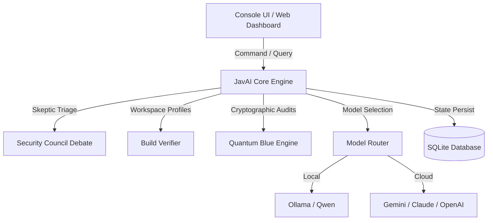

# JavAI Research Edition
> **Adversarial Security Agent, Post-Quantum Cryptographer & Secure Code Architect**

JavAI is a production-grade, agentic security research engine built on Java 17. Designed as an automated co-pilot for vulnerability scanning, compliance verification, and cryptographic auditing, JavAI bridges the gap between classical security frameworks and post-quantum readiness.

---

## 🚀 Core Capabilities

### 1. Adversarial Security Agent
* **Automated Penetration Testing Plugins:** Integrates tools like `nmap`, `subfinder`, `httpx`, `katana`, `whois`, and `dns` to map target scopes and discover assets.
* **Agentic Security Council:** Evaluates vulnerabilities through persona-driven debates (Exploiter, Skeptic, Moderator) to confirm severities, reduce false positives, and log consensus decisions.
* **Skepticism-Driven Methodology:** Follows a strict validation lifecycle where findings are only reported after reproducibility checks and verified evidence logging.

### 2. Post-Quantum Cryptography (PQC) Portal
* **Quantum-Blue Engine:** Integrates Kyber-1024 (ML-KEM) encapsulation parameters and Dilithium-87 (ML-DSA) signing parameters for secure, quantum-resistant operations.
* **Cryptographic Auditing:** Automatically scans files to flag classical cryptographic patterns (e.g., classical RSA, ECDSA, AES-CBC mode, SHA-1/MD5) broken by Shor's or Grover's algorithms.
* **Secure File Sealing:** Notarizes, signs, and encrypts files utilizing AES-256-GCM and hybrid post-quantum cryptography.

### 3. Workspace Health & Build Verifier
* **Repository Inspector:** Maps active project folders, extracts language ratios, and auto-detects frameworks (Maven, Gradle, NPM, Cargo).
* **Automated Compilation Checks:** Spawns isolated processes to run unit test commands in custom sandbox directories, preventing environment pollution.

### 4. Visual Dashboard & Gateway
* **Interactive Control Center:** Houses a local visual browser terminal, observations counters, and build run logging.
* **OpenAI-Compatible Gateway:** Exposes a standalone `/v1/chat/completions` API endpoint, enabling external developer environments to interact with the JavAI agent.

---

## 🛠️ System Architecture



---

## 📋 Prerequisites
Ensure your host machine has the following dependencies:
* **Java Development Kit (JDK):** Version 17 or higher.
* **Apache Maven:** Version 3.8.0 or higher.
* **Node.js (for global CLI):** Version 16.0.0 or higher.

---

## ⚡ Installation & Execution

### Option A: Global CLI Installation (Recommended)
Install the CLI wrapper globally using the NPM package manager to run scans and audits from any target repository directory:
```bash
npm install -g @rhyugen/javai
javai
```

### Option B: Local Maven Execution
For development, cloning, and extending the framework:
```bash
# Clone the repository
git clone https://github.com/psycho-prince/JAV-AI.git
cd JAV-AI

# Compile and test
mvn clean test

# Launch Console & Web Server
mvn exec:java
```

Once running, the visual dashboard is accessible in your browser at `http://localhost:1337`.

---

## 🔒 Security Triage Disclaimer
This software is intended for authorized research, code compilation auditing, and defensive mitigation verification. All vulnerability triage operations follow the **Skepticism Rule**: no vulnerabilities are asserted or reported without validated evidence logs, verified reproducibility, and programmatic validation.
